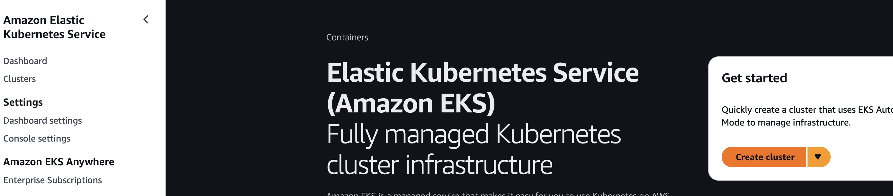

# Kubernetes

## Création d'un cluster EKS

Depuis la console AWS, créer un cluster EKS (en auto mode)

<figure><figcaption></figcaption></figure>

### Sélection du mode Auto

<figure><figcaption></figcaption></figure>

### Paramètres de configurations

<figure><figcaption></figcaption></figure>

* `Name` : nom que vous donnez à votre cluster
* `Kubernetes version` : 1.34
* `Cluster IAM role` : s'assurer de sélectionner le role LabEksClusterRole
* `Node IAM role` : s'assurer de sélectionner le role LabEksNodeRole

Puis le bouton <mark style="color:orange;">`Create`</mark> pour lancer la création du cluster


Le temps de création du cluster est relativement long, environ 10-15mn !


## Ajout des credentials AWS

Depuis `Manage Jenkins ⇒ Credentials`, ajouter les credentials pour AWS pour que le pipeline puisse se connecter à l'environnement AWS Academy&#x20;

<div data-full-width="false"><figure><figcaption></figcaption></figure></div>

## Installation de la commande kubectl

La commande `kubectl` permet d'intéragir avec l'API Kubernetes, et celle-ci doit être installée sur la VM.

```javascript
sudo apt update
sudo apt install curl
curl -LO https://dl.k8s.io/release/$(curl -L -s https://dl.k8s.io/release/stable.txt)/bin/linux/amd64/kubectl
sudo install -o root -g root -m 0755 kubectl /usr/local/bin/kubectl
kubectl version --client
```
